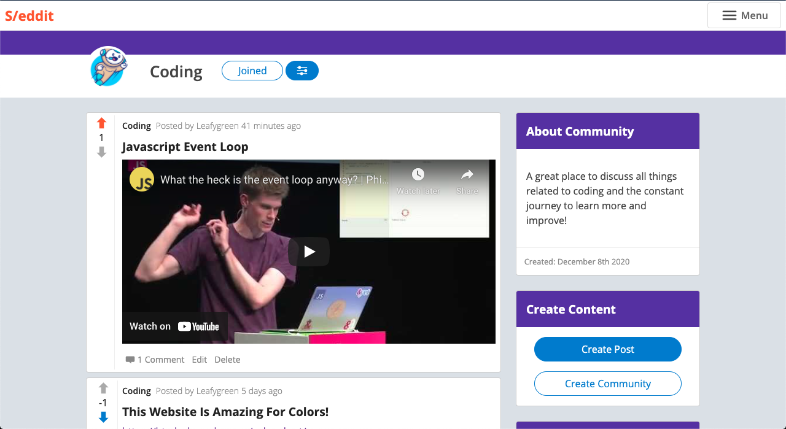

# S/eddit

This website was made based on the curriculum of [The Odin Project's](https://www.theodinproject.com/home) Javascript section. S/eddit really is a cumulative representation of the skills knowledge and understanding I have gained through The Odin Project. The goal was to emulate Reddit in much of the functionality, and to that end I feel this was and is quite a success. This website was a real jump in terms of my understanding of React and the usage of hooks and all the added flexability they offer. While its still not 100% feature and function complete, it functions extremely well and looks and feels quite similar to the real [Reddit](https://www.reddit.com/).

[Live Demo](https://kgilla.github.io/reddit-clone/)

## Learning Objectives

- Utilize all the functionality from [my own API](https://github.com/kgilla/reddit-clone-api).
- Further my knowledge of [ReactJS](https://reactjs.org/) and make much more use of React Hooks and useContext() within my code.
- Gain more understanding of React Hooks by authoring my own to manage major state items such as window size and auth state.
- Attempt to make compoents more reusable and less application specific.
- Handle routes with [Reach Router's](https://reach.tech/router/) big brother, [React Router](https://reactrouter.com/) and make better use of their API to manage rerouting and history for auth based issues.
- Use [PassportJS](http://www.passportjs.org/) and [JWT (JSON Web Tokens)](https://jwt.io/) to authorize users and manage auth state between front and back ends
- Further my understanding of using asynchronous code in Javascript - centered around Async/Await.
- Write all my own CSS and don't utilize any frameworks to help with responsive layout or overall design.
- Improve my overall design ideas and layout structuring
- Make my code more modular and partitioned overall

## Images

#### Main Landing Page

#### Support For Nested Comment Replies

#### Creation Of Communities

#### Support For Muliple Post Types

#### User Profile

#### User Specific Side Navigation Bar

## License

[MIT](https://choosealicense.com/licenses/mit/)
